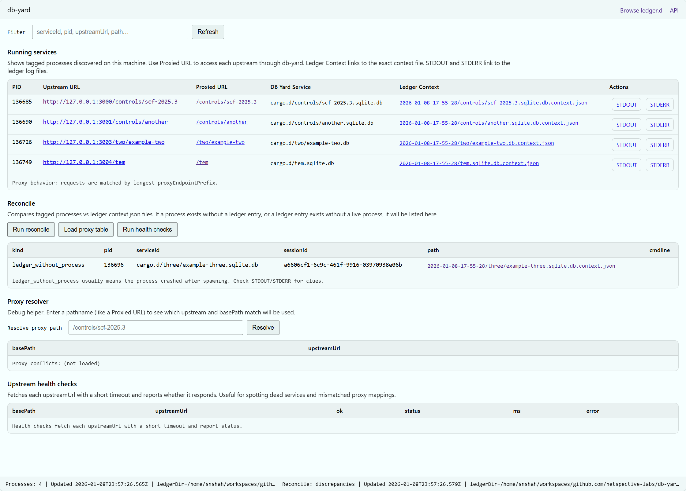

`db-yard` is a file-driven process yard for “database cargo.” It treats your
filesystem as the control plane. You drop databases into a cargo directory, and
db-yard discovers, classifies, spawns, supervises, and exposes them as local web
services using deterministic, inspectable state written entirely to disk.

There is no registry, no background daemon requirement, and no internal
control-plane database. Everything db-yard knows is encoded in files you can
read, version, copy, audit, or generate tooling around.

## Mental model: a Navy Yard

A SQLite file on disk is cargo.

Dropping cargo into the "yard" (`./cargo.d` directory) makes it eligible to be
launched. The spawn-state directory is the operational ledger. JSON context
manifests and logs are written to disk so other tools, scripts, reverse proxies,
and later invocations of `yard.ts` can see what is running without needing an
API.

The filesystem is the API.

- The yard is a place where cargo crates get launched as vessels.
- Databases are cargo crates.
- Spawned processes are launched vessels.
- Ports are berths.
- JSON context files are manifests you can hand to other tools.
- The `ledger.d` directory is the ship’s log.

This framing is intentional. db-yard is not an app server or orchestrator in the
Kubernetes sense. It is closer to a dockyard that launches things predictably
and writes down exactly what it did.

## What db-yard supports

Today, db-yard focuses on local-first, deterministic process orchestration for:

- SQLPage applications stored inside SQLite databases
- surveilr RSSDs (SQLite databases with `uniform_resource` tables)

Other tabular formats such as DuckDB or Excel may be discovered as cargo but are
not currently exposable services.

## High-level workflows

All workflows are built on the same on-disk ledger and reconciliation logic.

### 1. Materialize and exit

Scan cargo roots, spawn everything exposable, write state to disk, and exit.

This is ideal for CI pipelines, deterministic local runs, reverse proxy
generation, and one-shot demos.

Command:

```bash
bin/yard.ts start
```

### 2. Continuous watch and reconcile

Run db-yard continuously. The filesystem is watched and operational truth is
reconciled to intent.

- New cargo appears: spawned
- Cargo disappears: killed
- Process dies: respawned

Command:

```bash
bin/yard.ts start --watch
```

Watch mode reuses the same ledger format as materialize mode, but continuously
reconciles it instead of producing a one-shot session.

⚠️ The `--watch` option starts a service and when the service ends using Ctrl+C
(`SIGINT`) all the spawned processes will get cleaned up.

## Discovery and classification

### Discovery

db-yard recursively walks one or more cargo roots using deterministic glob
rules.

Typical defaults include:

- `**/*.db`
- `**/*.sqlite`
- `**/*.sqlite3`
- `**/*.sqlite.db`
- `**/*.duckdb`
- `**/*.xlsx`

### Classification

Each candidate file is classified cheaply and deterministically:

- If SQLite-like:

  - If it has a `uniform_resource` table, it is a surveilr RSSD and spawned via
    `surveilr web-ui`
  - Else if it has a `sqlpage_files` table, it is a SQLPage app and spawned via
    `sqlpage`
  - Else it is plain SQLite and ignored by `exposable()`
- Non-SQLite tabular files may be discovered but are not exposable today

There are no heuristics beyond this and no background indexing.

## Proxy prefix assignment

Each exposable service is assigned a proxy prefix derived from its path relative
to the cargo root.

The filename is normalized by stripping compound database extensions such as
`.sqlite.db`.

Examples:

- `cargo.d/controls/scf-2025.3.sqlite.db` → `/apps/sqlpage/controls/scf-2025.3`
- `cargo.d/two/example-two.db` → `/apps/sqlpage/two/example-two`

This prefix is passed to the spawned service, written into the context JSON,
used by the web UI, and consumed by reverse proxy generators.

## Port allocation

Ports are assigned incrementally starting at a configurable base (default 3000).

db-yard automatically skips ports that are already in use and continues
searching until a free port is found. This behavior is enabled by default.

In watch and smart-spawn modes, db-yard also avoids collisions by inspecting the
existing ledger and live processes.

## Spawn-state ledger

Every spawned service writes three files:

- `<name>.context.json`
- `<name>.stdout.log`
- `<name>.stderr.log`

These live under a session directory inside the spawn-state home.

### Session directories

Materialize mode (`start` without `--watch`) creates a timestamped session
directory:

```
ledger.d/2026-01-07-20-15-00/
```

Watch and smart-spawn modes use a stable session directory so state is
continuously reconciled rather than replaced.

### Mirrored layout

Session directories mirror the cargo directory structure:

```
ledger.d/2026-01-07-20-15-00/
  controls/
    scf-2025.3.sqlite.db.context.json
    scf-2025.3.sqlite.db.stdout.log
    scf-2025.3.sqlite.db.stderr.log
```

This makes tracing a running service back to its source file trivial.

## Smart spawn and reconciliation

By default, materialization runs in smart-spawn mode.

Smart spawn inspects existing tagged processes and the ledger before starting
anything:

- If a service for the same provenance is already running, it is not spawned
  again
- If cargo is removed, the corresponding process is killed
- If cargo is added, materialization is re-run and only the delta is applied

Process identity is keyed by the absolute provenance path of the database file.
An optional strict mode can also require matching the session ID.

This allows repeated runs of `yard.ts start` or `yard.ts start --watch` to be
idempotent and safe.

## CLI overview

### Start

```bash
bin/yard.ts start \
  --cargo-home ./cargo.d \
  --ledger-home ./ledger.d \
  --verbose essential|comprehensive \
  --watch
```

### List spawned processes (like Linux `ps`)

```bash
bin/yard.ts ps
bin/yard.ts ps --extended
bin/yard.ts ps --reconcile
```

The `--reconcile` option compares the on-disk ledger with live tagged processes
and highlights drift.

### List context available in ledgers

```bash
bin/yard.ts ls
```

### Kill

```bash
bin/yard.ts kill
bin/yard.ts kill --clean
```

### Reverse proxy configuration

```bash
bin/yard.ts proxy-conf --type nginx
bin/yard.ts proxy-conf --type traefik
bin/yard.ts proxy-conf --type both
```

Supported options include prefix overrides, strip-prefix, and engine-specific
flags.

## Web UI



You can start a web-based administration server using:

```bash
./bin/web-ui/serve.ts
```

By default it starts on:

```
http://127.0.0.1:8787/
```

The root URL redirects automatically to:

```
/.db-yard/ui/
```

### Running Services

This shows all currently tagged processes managed by db-yard.

For each service you can see:

- PID of the running process
- Upstream URL (where the service actually listens)
- Proxied URL (the local path exposed by db-yard)
- DB Yard Service (serviceId, with sessionId available via tooltip)
- Ledger Context (link to the exact `*.context.json` file in `ledger.d`)
- Actions to view STDOUT and STDERR logs

Everything shown here maps directly to files in `ledger.d` or to an active
process.

### Reconcile table

This compares live tagged processes against ledger context files.

It highlights:

- ledger entries without a running process (likely crashed or stopped)
- processes without a corresponding ledger entry (unexpected or orphaned)

This is useful for quickly spotting inconsistencies between “what should be
running” and “what actually is”.

### Ledger browser

The “Browse ledger.d” link lets you navigate the ledger directory directly in
the browser, including context files and logs.

### Proxy debugging and tracing

The UI and API expose explicit debug endpoints to understand proxy behavior:

- `/.db-yard/api/proxy-debug.json?path=/some/path` Shows which proxy rule
  matched, how the upstream URL is constructed, and which headers are forwarded
  (with secrets redacted).

- `/.db-yard/api/proxy-roundtrip.json?path=/some/path` Performs a real upstream
  request and reports status, headers, latency, and a small response preview.

You can also trace any proxied request end-to-end by adding:

```env
?__db_yard_trace=1
```

or sending the header:

```yaml
x-db-yard-trace: 1
```

The response will include trace headers showing the matched base path and
upstream, and the server logs a single structured trace line for correlation.

### About the built-in proxy

The db-yard proxy is intentionally simple and transparent.

It’s ideal for:

- local development
- testing routing behavior
- validating upstream services
- lightweight, low-traffic use
- debugging headers and path rewriting

For anything beyond that (higher traffic, TLS termination, auth, rate limiting,
resilience, observability), you should point industrial-grade proxy servers such
as NGINX, Traefik, Envoy, or cloud load balancers directly at the upstream URLs.
db-yard can already generate proxy configuration inputs from ledger state to
support that workflow.

The design intent is clarity and debuggability first, not to replace production
proxy infrastructure.
