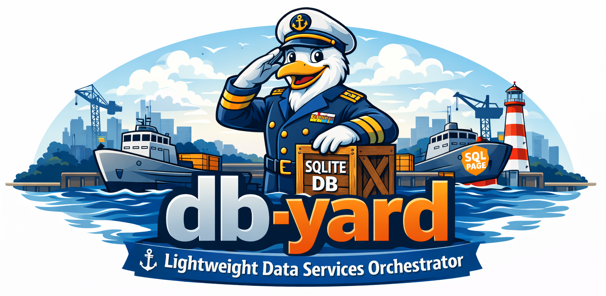

`db-yard` is a file-driven process yard that watches for SQLite database files
and automatically turns them into running local services.

A SQLite file on disk is “cargo.” Dropping cargo into the yard launches a
service. Removing it decommissions the service. There is no registry and no
internal control-plane database. The filesystem is the control plane.

`db-yard` is meant for developer workflows that are SQLite-first and
deterministic. It is especially useful for SQLPage apps and surveilr RSSDs,
where the database is the unit of deployment.

How it works in practice

You point `db-yard` at one or more glob patterns (not directories). It watches
the matched filesystem locations. When a matching database file appears,
`db-yard` chooses a spawn driver, assigns a free port, launches the right
process, and writes a JSON “record” describing what it started (PID, port,
command, metadata). If the database file changes, metadata is refreshed (without
restarting the process). If the database file disappears, the process is
terminated and its JSON record is removed.

The spawned-state directory is treated as an operational ledger: JSON records
and logs are written to disk so that other tools can observe what is running
without needing shared memory or an API.

Mental model: a “Navy Yard”

- The yard is passive until cargo arrives.
- Databases are cargo crates.
- Spawned processes are launched vessels.
- Ports are berths.
- JSON state files are manifests.

## CLI Overview

```bash
bin/yard.ts [options]
bin/yard.ts spawned [options]

# helpers
bin/yard.ts help
bin/yard.ts completions
```

- The default command starts the orchestrator.
- The `spawned` subcommand inspects or terminates processes started in previous
  sessions.

## Core Concepts

Watch globs

You tell `yard.ts` what to watch using glob patterns.

Example:

- `./cargo.d/**/*.db`

Every matching SQLite file is considered a candidate “cargo crate.” For each
candidate, `db-yard` will try to determine how to launch it.

Spawn drivers (auto-detected)

For each database file, `db-yard` chooses a driver like this:

1. If the DB has a `.db-yard` table with key `spawn-driver`, that value is used.
2. Else if table `uniform_resource` exists, it is treated as a surveilr RSSD web
   UI.
3. Else if table `sqlpage_files` exists, it is treated as a SQLPage app.

If none of these conditions match, the file is ignored.

Session directories and files

Each run creates a new session directory inside `spawned-state-path`.

Example:

```
spawned.d/
  2026-01-06-14-16-11/
    spawned-pids.txt
    <session files...>
```

Important update: session files mirror your cargo folder layout.

If your database files live under subdirectories, `db-yard` will store the JSON
and log files in matching subdirectories under the session directory.

Example cargo:

```
cargo.d/
  alpha/app.db
  beta/reports/my.sqlite.db
```

Example session output:

```
spawned.d/2026-01-06-14-16-11/
  spawned-pids.txt
  alpha/
    app.db.<hash>.json
    app.db.<hash>.stdout.log
    app.db.<hash>.stderr.log
  beta/reports/
    my.sqlite.db.<hash>.json
    my.sqlite.db.<hash>.stdout.log
    my.sqlite.db.<hash>.stderr.log
```

Notes:

- `<hash>` is derived from the instance id. It prevents collisions when multiple
  instances share the same basename.
- `spawned-pids.txt` always stays at the session root (not nested), so “kill
  all” logic has one predictable place to read.

Crash resilience

Spawned child processes are detached so they can survive orchestrator crashes.
PIDs are tracked in `spawned-pids.txt` for later inspection or cleanup.

## Common Usage Patterns

Default usage (recommended starting point)

Watch all SQLite databases under `cargo.d` recursively.

```bash
yard.ts
```

Equivalent to:

```bash
yard.ts --watch './cargo.d/**/*.db'
```

Explicit watch glob

Use this when you want to be very clear about what is watched.

```bash
yard.ts --watch './cargo.d/**/*.db'
```

You can repeat `--watch` multiple times:

```bash
yard.ts \
  --watch './cargo.d/**/*.db' \
  --watch './other-cargo/**/*.sqlite'
```

Environment variables

By default, `yard.ts` passes the current environment to spawned processes.

If that is too permissive, use `--env` to allow only variables whose NAMES match
one or more regex patterns. Only env var names are filtered, not values.

```bash
bin/yard.ts \
  --env '^(PATH|HOME|USER|SHELL|LANG|LC_|TERM|TZ)$' \
  --env '^DBYARD_' \
  --env '^SQLPAGE_'
```

Verbose, operator-friendly output

Shows colored messages when databases are detected, spawned, reconciled, or
stopped.

```bash
bin/yard.ts --verbose
```

Verbose mode also prints:

- spawn/stop/refresh decisions
- log file locations
- reconciliation actions (only when something actually changes)

Custom spawned state directory

Useful in CI, containers, or multi-user environments.

```bash
yard.ts --spawned-state-path /var/db-yard/spawned
```

Each run still creates a timestamped session directory inside this path.

Enable the admin server (optional)

Starts a lightweight HTTP server for introspection and local testing.

```bash
yard.ts --web-ui-port 9090
```

Optional host override:

```bash
yard.ts --web-ui-port 9090 --web-ui-host 0.0.0.0
```

Binding beyond localhost is strongly discouraged.

## Process Management

List all managed processes (across sessions)

```bash
yard.ts spawned
```

This scans all session directories and reports:

- PID
- alive/dead status
- command (best-effort)
- how many sessions reference the PID

Kill all managed processes (dangerous)

```bash
yard.ts spawned --kill
```

This:

- de-duplicates PIDs across sessions
- skips the current `yard.ts` process
- sends SIGTERM, then SIGKILL if needed

Use with care.

## Web UI and Reverse Proxy

`db-yard` includes an optional built-in web UI that provides lightweight
inspection, session-file access, unsafe debugging tools, and request routing to
spawned services. It is intentionally minimal and local-first.

Enable it by supplying an admin port:

```bash
yard.ts --web-ui-port 9090

# good for testing / evaluation
yard.ts --kill-all-on-exit --web-ui-port 9897 --verbose
```

By default it binds to `127.0.0.1`. You can override this with `--web-ui-host`,
but exposing it beyond localhost is strongly discouraged.

### What the Web UI provides

1. Root index (`/`)

- `GET /` shows an HTML index of all currently running instances.
- It lists the computed proxy prefixes and where they forward.

2. Admin endpoints (`/.admin`)

These endpoints are intentionally prefixed with `/.admin` so they are harder to
stumble into by accident.

- `GET /.admin`

  Returns a JSON snapshot of all running instances.

- `GET /.admin/index.html` (or `GET /.admin/`)

  Displays a simple HTML page showing:

  - running instances (with links)
  - session files (JSON + logs)

3. Session file access (`/.admin/files/...`)

This section is updated to match the current code.

- `GET /.admin/files/<path>` streams a file from the current session directory.

Key behavior:

- `<path>` can include subdirectories.
- The path must be a safe relative path. The server rejects:

  - absolute paths
  - any path containing `..`
  - backslashes used for escaping
  - NUL bytes

This matters because session files may be stored under nested directories that
mirror the watched cargo structure.

Examples:

- `/.admin/files/alpha/app.db.<hash>.json`
- `/.admin/files/beta/reports/my.sqlite.db.<hash>.stderr.log`

4. Unsafe SQL endpoint (`/SQL/unsafe`)

- `POST /SQL/unsafe/<id>.json`

  Executes ad-hoc SQL against the SQLite database for a running instance.

  Request body:

  ```json
  { "sql": "select * from sqlite_master" }
  ```

  This is explicitly unsafe. It bypasses application logic and executes SQL
  directly via the SQLite CLI. It is intended only for local inspection and
  debugging.

5. Reverse proxy behavior (all other paths)

All other paths are treated as reverse-proxy traffic to spawned services.
Routing works like this:

- Prefix routing: if the request path starts with a known proxy prefix (example
  `/alpha/app/`), traffic is proxied to that instance.

- Single-instance fallback: if exactly one instance is running, and the path
  does not match any prefix, the request is proxied to that one instance.

If no target can be selected, the server returns a JSON 404 with a hint pointing
you to `/` or `/.admin/index.html`.

Important note for juniors: the proxy prefix is computed from the watched
relative path and filename unless overridden.

Default prefix rules

If `dbRelPath` is something like:

- `alpha/app.db` then the default prefix becomes `/alpha/app/`
- `beta/reports/my.sqlite.db` then the default prefix becomes
  `/beta/reports/my/`

You can override the prefix per database by writing this key to the `.db-yard`
table:

- `proxy-conf.location-prefix` = `/whatever/you/want/`

### Security notes

The web UI is intentionally powerful and intentionally unsafe in places.

- Do not bind it to `0.0.0.0` unless you fully trust your network.
- Treat `/.admin` and `/SQL/unsafe` as local-only debugging tools.
- Treat the web UI as a development and inspection surface, not a hardened admin
  plane.

## Using `--kill-all-on-exit` During Development

During development of `yard.ts`, it is easy to leave orphaned processes running
if the orchestrator crashes or is restarted frequently.

To make development safer, `db-yard` provides:

```bash
--kill-all-on-exit
```

When enabled:

- On process exit (Ctrl+C, SIGTERM, or normal shutdown)
- `db-yard` scans session directories it owns
- Collects all PIDs recorded in `spawned-pids.txt`
- Gracefully terminates those processes (SIGTERM, then SIGKILL if needed)

Example:

```bash
yard.ts --watch './cargo.d/**/*.db' --kill-all-on-exit
```

Important notes:

- This flag is intended for development and local testing.
- In normal usage, `db-yard` is designed so spawned processes survive
  orchestrator restarts.
- Enabling `--kill-all-on-exit` changes that contract.

Do not use `--kill-all-on-exit` in production or shared environments unless you
explicitly want all spawned services to terminate whenever `db-yard` exits.

## Reverse Proxy Guide for db-yard (NGINX + Traefik)

This guide explains how to put a real reverse proxy in front of db-yard spawned
services.

db-yard’s built-in web UI is intentionally minimal and local-first. For anything
beyond local testing (custom hostnames, TLS, multiple entrypoints,
production-like routing, auth, rate limiting), use a dedicated reverse proxy.

The key idea is that db-yard writes a JSON “ledger” per running instance. Those
JSON files contain everything a reverse proxy needs to route requests: instance
id, listen host/port, and a stable proxy prefix.

### What db-yard produces

During a session, db-yard creates a session directory under your
`--spawned-state-path`.

Example:

```
spawned.d/
  2026-01-06-14-16-11/
    spawned-pids.txt
    reports/
      a.sqlpage.db.<hash>.json
      a.sqlpage.db.<hash>.stdout.log
      a.sqlpage.db.<hash>.stderr.log
    ops/
      telemetry.rssd.db.<hash>.json
      telemetry.rssd.db.<hash>.stdout.log
      telemetry.rssd.db.<hash>.stderr.log
```

Notes:

- `spawned-pids.txt` is at the session root.
- JSON manifests and logs are stored under relative subdirectories that mirror
  the DB’s relative path under the watch root.
- Each running instance has a v1 JSON record with fields like:

  - `id` (instance identity)
  - `kind` (`rssd` or `sqlpage`)
  - `listenHost` and `port`
  - `proxyEndpointPrefix` (the suggested routing prefix)
  - `dbPath` and `dbRelPath`

### Why use a dedicated reverse proxy

A reverse proxy (NGINX, Traefik, Caddy, etc.) gives you:

- Hostname routing (example.com vs internal.example.com)
- TLS certificates (Let’s Encrypt) and HTTP/2
- Authentication middleware, IP allowlists, Basic Auth
- Compression, caching, rate limits
- More flexible routing rules
- Central logging and metrics

The pattern is:

1. db-yard watches and spawns local services
2. db-yard writes JSON manifests
3. A generator reads those JSON manifests and produces proxy configuration
4. The reverse proxy loads those configs and routes traffic to the spawned
   services

### Routing vocabulary

You will see two routing concepts in db-yard outputs:

1. Upstream target

- This is the actual local service endpoint.
- It is typically `http://127.0.0.1:<port>`.

2. Proxy prefix

- This is where you want the service to live behind the proxy.
- db-yard computes `proxyEndpointPrefix` like:

  - If the DB is at `cargo.d/abc/def/my.sqlite.db`, default prefix becomes
    `/abc/def/my/`
  - You can override per DB using the `.db-yard` table key
    `proxy-conf.location-prefix`

When a request comes in at `/abc/def/my/...`, the proxy routes it to
`http://127.0.0.1:<port>`.

Important: many web apps expect a prefix. db-yard drivers set
`SQLPAGE_SITE_PREFIX` when spawning, and you can forward the prefix in proxy
headers if you want.

### Generating proxy configs from JSON

db-yard includes a helper module for this:

- `lib/reverse-proxy-conf.ts`

It can:

- read all live JSON records under a spawned-state root
- generate per-instance NGINX config snippets
- generate per-instance Traefik dynamic config files
- generate a bundled config file containing all routes

Conceptually:

- JSON record -> reverse proxy route

You can run a small script (or add a CLI subcommand) that calls
`generateReverseProxyConfsFromLiveJson({ ... })`.

### NGINX configuration model

NGINX usually works as:

- a main nginx.conf
- an `include` directory for site or route snippets

Example include structure:

```
/etc/nginx/nginx.conf
/etc/nginx/conf.d/
  db-yard.generated.conf
  db-yard.<id>.<hash>.conf
```

The generator produces a `server { ... location ... }` block per instance.

#### Example generated NGINX snippet (conceptual)

A typical generated snippet routes a prefix to an upstream:

- Incoming: `/abc/def/my/...`
- Upstream: `http://127.0.0.1:43210`

NGINX sketch:

- `location /abc/def/my/ { proxy_pass http://127.0.0.1:43210; }`

You can choose whether to strip the prefix before forwarding.

Prefix stripping:

- When enabled, `/abc/def/my/assets/app.css` becomes `/assets/app.css` upstream.

db-yard supports this option in config via `.db-yard` keys:

- `nginx-proxy-conf.strip-prefix = true|false`

#### Recommended NGINX patterns

1. One shared `server` block, many `location` blocks

- Easier to manage and reload.
- Prefer this if you want all apps behind one hostname.

2. One `server` block per app

- More isolated, but you end up with many server blocks.
- Useful if you route apps by hostname instead of prefix.

3. Keep NGINX as the “outer” proxy, keep db-yard services local-only

- Run spawned services bound to localhost (default).
- Expose only NGINX to your network.

#### How to apply generated NGINX config

Typical workflow:

1. Generate configs into an include directory
2. Ensure your main NGINX config includes that directory
3. Reload NGINX

Reload:

- `nginx -t` (validate)
- `nginx -s reload` or `systemctl reload nginx`

### Traefik configuration model

Traefik uses “dynamic configuration” files (YAML or TOML) that define:

- routers (match rules)
- services (upstream backends)
- middlewares (strip prefixes, auth, etc.)

File-provider layout:

```
/etc/traefik/traefik.yml
/etc/traefik/dynamic/
  db-yard.generated.yaml
  db-yard.<id>.yaml
```

The generator produces a router and a service for each db-yard instance.

#### Example generated Traefik config (conceptual)

- Rule: `PathPrefix(`/abc/def/my/`)`
- Service: `http://127.0.0.1:43210`

Optional middleware:

- `stripPrefix` with prefixes: `/abc/def/my`

db-yard supports these `.db-yard` keys:

- `traefik-proxy-conf.location-prefix`
- `traefik-proxy-conf.rule`
- `traefik-proxy-conf.entrypoints` (example: `web, websecure`)
- `traefik-proxy-conf.strip-prefix = true|false`

#### How to apply generated Traefik config

1. Configure Traefik to watch a directory for dynamic config
2. Generate YAML files into that directory
3. Traefik picks them up automatically

If you are using Docker, you can bind-mount the directory into the Traefik
container.

### Using db-yard JSON as the single source of truth

Treat the JSON as the contract:

- db-yard is responsible for lifecycle + writing accurate manifests
- config generation is responsible for translating manifests into proxy config
- reverse proxy is responsible for routing

This split keeps db-yard small and deterministic, while still enabling
“production-like” setups when you need them.

### Recommended workflows

#### A. Local development (simple)

- Run db-yard normally.
- Use the built-in `--web-ui-port` only for introspection.
- Access services directly on their ports when needed.

#### B. Local development (single entrypoint)

- Run db-yard
- Generate NGINX or Traefik configs from JSON
- Run a local proxy on one stable port
- Access everything through the proxy using prefixes

This feels closer to production while still being local.

#### C. Shared environment (team VM / dev server)

- Run spawned services bound to 127.0.0.1
- Run NGINX/Traefik bound to 0.0.0.0 with TLS
- Generate configs into the proxy’s include directory

### Safety notes

- The JSON manifests include full DB paths and command args. Treat them as
  sensitive operational data.
- If you generate proxy configs automatically, validate them before reload.
- Prefer “local-only” spawned services and expose only the proxy.

### Caddy and others (later)

Caddy is a good fit when you want:

- very simple TLS and automatic certificates
- clean configuration
- a single binary with a good admin API

The same JSON-to-config approach applies:

- Read `proxyEndpointPrefix`, `listenHost`, `port`
- Emit a Caddyfile with `handle_path` blocks or `route` blocks

When you add Caddy support, keep the same design:

- db-yard produces JSON
- generators translate JSON -> proxy config
- proxy reloads or watches config

### TODO: add a CLI subcommand

If you want this to be turnkey, add a CLI command like:

- `yard.ts proxy-conf --nginx-out <dir> --traefik-out <dir>`

That command would:

- scan `--spawned-state-path`
- detect live instances
- write generated proxy config bundles

This keeps the workflow discoverable and consistent for juniors.
